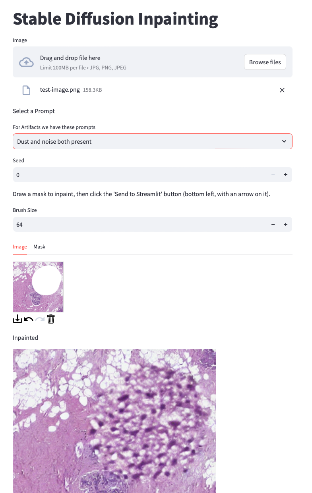

# Artifact Toolbox

Tools to detect and synthesize artifacts in whole slide images (WSI) from digital pathology. This work has been funded by the German Federal Ministry of Education and Research (BMBF, grant ids: 01IS21067A, 01IS21067B, and 01IS21067C).

## Artefact Detection

Install dependencies:

- `pip install tiffslide fastapi[all] streamlit`
- https://github.com/FraunhoferMEVIS/MedicalMultitaskModeling

Run the app (model weights are included with this repo): `streamlit run artefact_detector.py`.

The running app will look like this 

## Artifact Augmentation

In this repo we collect the current state for the artefact augmentation in Syndicad. 

### Getting started

- Download the [model weights](https://owncloud.fraunhofer.de/index.php/s/OsQxp3GLjxr0YZN) and place the folder into this repo. (Password is the name of the project with only small letters)

- Create the environment to run the code. Then run

`pip install -r requirements.txt`

### Api

"generate_artifacts" provides a simple interface to experiment with the artefact generation pipeline. See the example notebook.
For a single image of size 512x512 (recommended as the pipeline was trained with this size) 8 GB of vRAM are recommended. For 4 images, 10 GB are prefered. The whole model should take about 4,5 GB of GPU vRAM.
CPU infernece is also possible but requires longer to process. 

### UI interface
To run the model with a streamlit UI, run:

 `streamlit run inpainting.py` 
 
in this folder. Head over to your browser and got to "http://localhost:8501/". 

The running app will look like this

